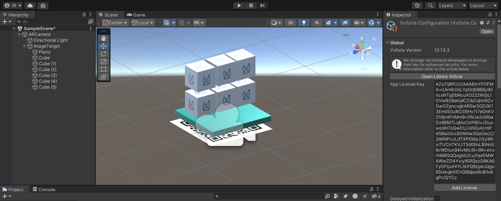
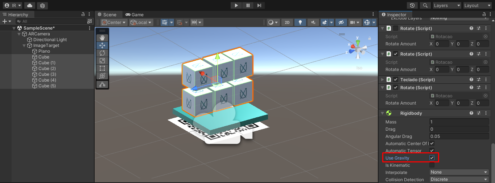

#  Projeto de Realidade Aumentada
<f2 align = "left"> **O projeto a ser apresentado resultará na visualização de um modelo 3D, sendo melhor caracterizado ao longo do processo.**</f2> 
<p>Vuforia é uma das plataformas mais utilizadas no desenvolvimento de Realidade Aumentada, sendo integrado nativamente com o Unity e possível usá-lo com o próprio editor (MOURA, 2018).</p>
<hr> </hr>
<p>Para instalá-los, basta acessar:</p>
<p>📌 <a href="https://developer.vuforia.com/vui/auth/login?url=%2Fdownloads%2Fsdk%3F_%3D1678117884">Download Vuforia</a></p>
<p>📌 <a href="https://unity.com/download">Download Unity</a></p>

#  Passo a passo
No primeiro momento, deve-se fazer login e criar uma licença para registrar alvo do modelo. Em seguida, é preciso fazer a importação do banco de dados que será utilizando, sendo as features e targets.

 
<p><i>Target utilizado  |  Mapeamento do target para projetar a realidade aumentada</i></p>
<hr>
<p>Em seguida, deve-montar uma cena, nesse caso foi construída da seguinte forma:</p>
<p>📌 Inclusão da imagem Target (alvo), a Câmera AR e o plano de fundo </p>


<hr>

#  Scripts
<p>📌 Para rotacionar os cubos</p>

```javascript
using System.Collections;
using System.Collections.Generic;
using UnityEngine;

public class rotate : MonoBehaviour
{
    public Vector3 rotateAmount;
    void Start()
    {
        
    }

    void Update()
    {
        transform.Rotate(rotateAmount * Time.deltaTime);
    }
}
```
<i>Deve-se ainda configurar os eixos, nesse caso foram utilizados os seguintes valores: X = 50, Y = 50, Z = 50</i>
<p>📌 Para movimentá-los através do teclado, para cima e para baixo (pulos)</p>

```javascript
using System.Collections;
using System.Collections.Generic;
using UnityEngine;

public class Teclado : MonoBehaviour
{
    void Start()
    {
        
    }

    void Update()
    {
        if(Input.GetKey(KeyCode.LeftArrow))
        {
            transform.Translate(0.1f, 0f, 0f );
        }
        if(Input.GetKey(KeyCode.RightArrow))
        {
            transform.Translate(-0.1f, 0f, 0f );
        }
        if(Input.GetKey(KeyCode.DownArrow))
        {
            transform.Translate(0f, 0f, 0.1f );
        }
        if(Input.GetKey(KeyCode.UpArrow))
        {
            transform.Translate(0.1f, 0f, -0.1f );
        }

    }
}
```

<p>📌 Para movimentar os cubos nas laterais</p>

```javascript
using System.Collections;

using System.Collections.Generic;

using UnityEngine;

public class Movimento : MonoBehaviour

{

    Vector3 Vec;

    void Start()

    {


    }

    void Update()

    {

        Vec = transform.localPosition;

        Vec.y += Input.GetAxis("Jump") * Time.deltaTime * 5;

        Vec.x += Input.GetAxis("Horizontal") * Time.deltaTime * 5;

        Vec.z += Input.GetAxis("Vertical") * Time.deltaTime * 5;

        transform.localPosition = Vec;

    }

}
```

<p>📌 Para remover a gravidade dos elementos, eles devem ser selecionados e desabilitar a opção "Use gravity"</p>

