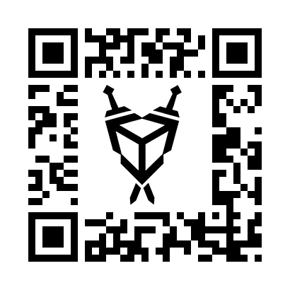

#  Projeto de Realidade Aumentada
<f2 align = "left"> **O projeto a ser apresentado resultará na visualização de um modelo 3D, sendo melhor caracterizado ao longo do processo.**</f2> 

Vuforia é uma das plataformas mais utilizadas no desenvolvimento de Realidade Aumentada, sendo integrado nativamente com o Unity e possível usá-lo com o próprio editor.

 

Para instalá-los, basta acessar:

📌 <a href="https://developer.vuforia.com/vui/auth/login?url=%2Fdownloads%2Fsdk%3F_%3D1678117884">Download Vuforia</a>

📌 <a href="https://unity.com/download">Download Unity</a>

#  Passo a passo
No primeiro momento, deve-se fazer login e criar uma licença para registrar alvo do modelo. Em seguida, é preciso fazer a importação do banco de dados que será utilizando, sendo as features e targets.

*Target utilizado*
